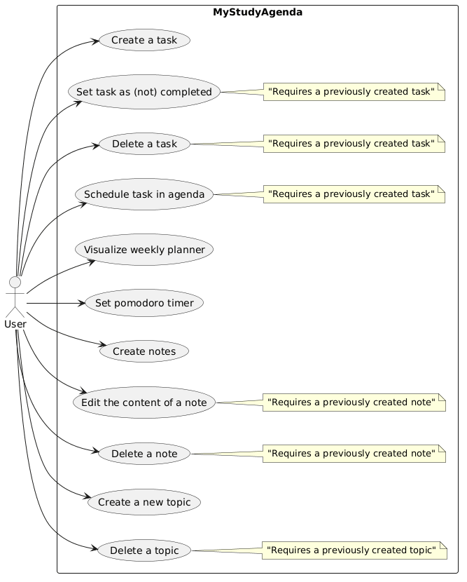

# Requirements

## User stories

- As a student, I want to create, tick as completed and delete tasks so that I can keep track of my study activities.  
- As a student, I want to assign priorities and time slots to tasks so that I can better plan my weekly schedule.
- As a student, I want to visualize my scheduled tasks in a weekly planner so that I have a clear idea of how my days are organized.   
- As a student, I want to create and organize notes under specific topics so that I can easily retrieve study materials.  
- As a student, I want to use a Pomodoro timer so that I can study in focused sessions with breaks.  
- As a student, I want to view my tasks and notes in a simple, clear interface so that I can quickly access what I need. 

## Use Case Diagram

## Requirements analysis

### Functional requirements

1. The system must allow the creation, update, and deletion of tasks.  
   - *Acceptance criteria*: user can add a task, modify it, and remove it; the changes must be reflected immediately in the task list.

2. The system must allow the creation, update, and deletion of notes.  
   - *Acceptance criteria*: user can add a note, modify it, and remove it.

3. The system must support topic creation and allow associating tasks and notes with topics.  
   - *Acceptance criteria*: user can create a topic; tasks and notes linked to it must show the topic’s name.  

4. The system must provide a weekly planner to visualize scheduled tasks.  
   - *Acceptance criteria*: the planner shows tasks distributed across the days of the week, based on their scheduled time slot; in the planner, tasks are represented as rectangles with different colours based on their priority (green for low, yellow for medium, red for high priority).

5. The system must provide a Pomodoro timer with customizable study and break durations.  
   - *Acceptance criteria*: user can start a Pomodoro session, see the countdown, and be notified when a session ends. User can also interrupt the timer. 

6. The system must update the graphical interface immediately after each operation (e.g. task/note creation, deletion).  
   - *Acceptance criteria*: no manual refresh is required; the UI reflects the latest data.  

### Non-functional requirements

1. The application runs offline without requiring internet connectivity.  
   - *Acceptance criteria*: all functionalities work without network access.  

2. The application must store user data persistently.  
   - *Acceptance criteria*: after restarting the software, all tasks, notes, and topics are preserved.  

3. The application must be simple and intuitive to use.  
   - *Acceptance criteria*: a new user should be able to create a task and a note within 5 minutes of first use.  

### Implementation requirements

1. The system must be developed in Python.  
   - *Motivation*: requirement of the Software Engineering course.  

2. The application must use Kivy / KivyMD for the graphical user interface.  
   - *Motivation*: ensures cross-platform compatibility and allows a native-like GUI in Python.  

3. The application must use SQLite for local data persistence.  
   - *Motivation*: lightweight relational database, easy to embed and distribute with the application.  

## Glossary

- **Task**: an activity to be completed, with associated priority and possibly scheduled.  
- **Note**: a piece of study material created by the user, optionally linked to a topic.  
- **Topic**: a category used to organize tasks and notes.  
- **Pomodoro**: a [time management method](https://en.wikipedia.org/wiki/Pomodoro_Technique) dividing work into intervals separated by short breaks.  
- **Planner**: the weekly visualization of tasks scheduled on specific days and times.  