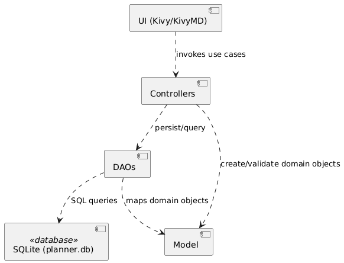
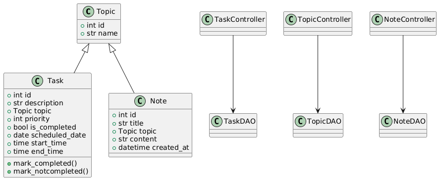
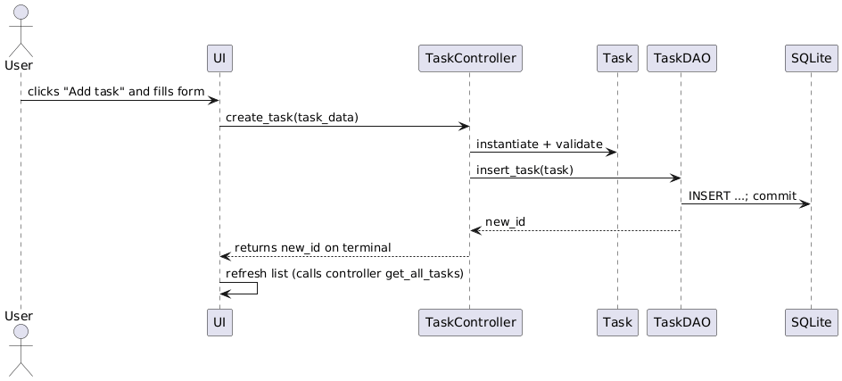
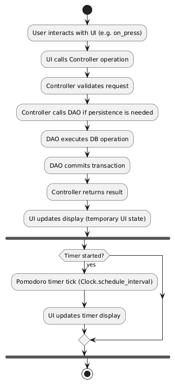

# Design

This chapter explains the strategies used to meet the requirements identified in the analysis. 

It describes the chosen architecture, the responsibilities of each component, how data is modelled and stored, and how the pieces interact at runtime.

## Architecture 

### Architectural style and motivation
MyStudyAgenda is a single-machine desktop application with a graphical user interface and a local persistence layer. The chosen architectural style is layered/modular with a clear separation of concerns:
- **Domain layer (Model)**: business objects (Task, Topic, Note) and pure domain logic
- **Persistence layer (DAO/Database)**: DAOs that abstract SQLite operations
- **Application layer (Controller)**: controllers that implement use cases and orchestrate DAOs and models
- **Presentation layer (View)**: UI screens, popups and widgets implemented with Kivy and KivyMD

A layered approach fits well for a standalone desktop app: it provides clarity, testability and a straightforward mapping to the codebase structure implemented (app.view, app.controller, app.model, app.db). Other styles (microservices, event-based distributed architectures) would be overkill for this application because the system runs locally without networked components.

### Chosen concrete architecture
The adopted architecture is an N-tier (4-layer) architecture described above. Each layer has restricted dependencies: the UI depends on controllers; controllers depend on models and DAOs; DAOs depend on the database driver. This keeps coupling low and makes unit testing easier (controllers and DAOs can be tested in memory).

### High-level component overview
Below is a simple component diagram (made with PlantUML) showing major pieces:

>Component Diagram

### Responsibilities
- **UI (Views and Widgets)**: render data, collect user input, show popups and lists. No persistence logic. Minimal logic: formatting, input validation that is purely presentational.
- **Controllers**: implement application use cases (create task, schedule task, mark complete, etc.). They convert user input into domain objects and call DAOs. They return domain objects to the UI.
- **Domain Models**: represent primitive objects Task, Topic, Note.
- **DAOs / Database**: encapsulate SQL schema, mapping between domain objects and table rows, and transaction management.

## Infrastructure

This is a single-process desktop application. therefore infrastructure needs are minimal.
- **Clients**: single desktop client (the application itself)
- **Servers / Brokers**: none
- **Database**: local SQLite file (planner.db) or in-memory when running tests

All components run inside the same OS process and machine. The database file is persisted on the same machine (or in-memory for tests).

## Modelling

### Domain driven design (DDD) modelling

#### Bounded contexts (DDD-style)

Given the small scope, there is effectively one bounded context: Personal Planner. Within it we can identify four main subdomains:

- Task management: tasks and scheduling, priorities, completion state.
- Note management: creating and editing notes bound to topics.
- Topic management: categorization used by tasks and notes.
- Utilities: Pomodoro timer and planner rendering (view only concerns).

No separate microservices or external contexts are required.

### Object-oriented modelling

The key domain entities and value objects of the software are:
- Topic
    - id: int
    - name: str
- Task
    - id: int
    - description: str
    - topic: Topic | None
    - priority: int
    - is_completed: bool
    - scheduled_date: date | None
    - start_time: time | None
    - end_time: time | None
    - methods: `mark_completed`, `mark_notcompleted`
- Note
    - id: int
    - title: str
    - topic: Topic | None
    - content: str
    - created_at: datetime

Repositories/DAOs:
- TopicDAO, TaskDAO, NoteDAO encapsulate SQL for CRUD operations

>Class Diagram

## Interaction

### How components communicate
- UI → Controller: synchronous direct calls (method invocation) when the user performs actions (button presses)
- Controller → DAO: synchronous direct calls; DAOs perform SQL queries and return results
- DAO → Database: SQL executed via sqlite3 library; commits are controlled by DAOs

There is no network I/O and no inter-process communication. Interaction patterns are simple request/response within a single process.

>UML sequence diagram example: *create task*

## Behaviour

### Components behaviour summary
- **UI**: reacts to user events (on_text, on_release) and calls controllers. Stateless with respect to domain except for temporary UI state (selected spinner item, inputs)
- **Controllers**: stateless from request perspective, they perform operations and return results. They encapsulate transactional boundaries: e.g. create_task calls DAO and interprets result
- **DAOs**: stateful as they hold a DB connection; they ensure atomic commits for modifications
- **Models**: may hold state (e.g. is_completed) and expose domain methods to mutate themselves

### Which components update state
- DAOs perform persistence updates (INSERT, UPDATE, DELETE). Controllers call DAOs when a use case requires a state change.
- In-memory model state is updated by controllers or model methods; persistence happens via DAOs.

### Timer / UI background behaviour
Pomodoro timer uses `Clock.schedule_interval` for ticking; it is UI-bound and purely local. Kivy manages these scheduled calls through its main event loop, which is the core mechanism that keeps the application running and responsive. In unit tests, real time is not allowed to elapse; instead, clock ticks are simulated by manually advancing Kivy’s clock, which makes it possible to verify the timer’s behavior quickly and without delays.

>Activity Diagram

## Data-related aspects

### Data to be stored
- Tasks: id, description, topic_id, priority, completion state, scheduled date, start/end times.
- Topics: id, name.
- Notes: id, title, topic_id, content, created_at timestamp.

These are user personal data stored locally. There is no authentication or multi-user support.

### Storage choice
SQLite (relational) was chosen as the storage approach because it is lightweight and embedded, ideal for desktop applications.

### Schema responsibilities
DAOs are responsible for:
- Creating tables
- Mapping between Python objects and rows
- Managing the DB connection lifecycle (commit/close)

### Queries and concurrency
Typical queries are CRUD and read-all operations.

Concurrent access is unlikely as it is a single process application, so SQLite default locking semantics suffice.

For unit tests the database is instantiated in-memory to ensure isolation.

### Data sharing between components
Controllers obtain domain objects from DAOs and pass them to UI. No server-side sharing or synchronization is implemented.

## Notes about extensibility and future improvements
The software was voluntarily primarily developed to be a simple offline desktop application, exactly because of its main objective: increasing focus and productivity for students. With respect to this goal, being forced to use internet connection could be detrimental.

However, for future improvements it could be cconsidered the fact that a user might want to see his tasks, notes and planner on multiple devices. If multi-device syncronization or remote storage were required, a local SQLite database would no longer be suitable. Instead, other technologies should be used (e.g. Google Firebase). In this case, an authentication procedure would be necessary and, preferably, encryption of each user’s personal data, including their individual tasks and notes.

Moreover, for richer scheduling or recurring tasks, domain model would need additional fields and business rules.