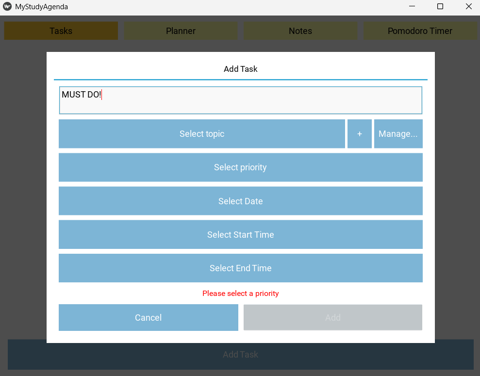
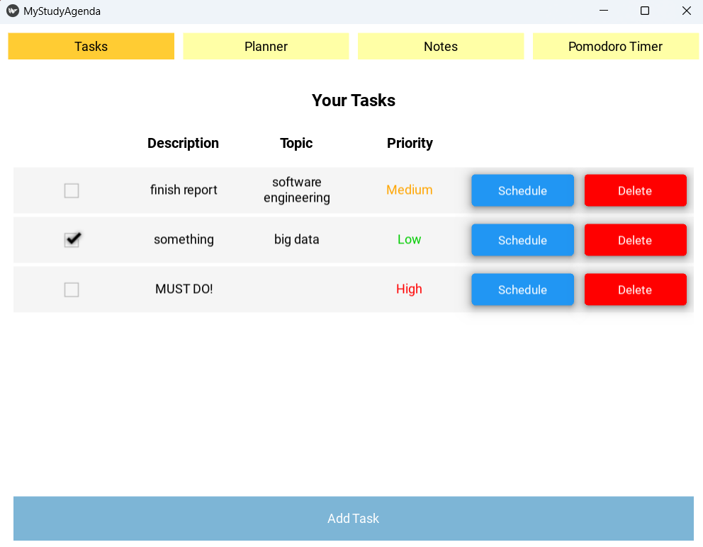
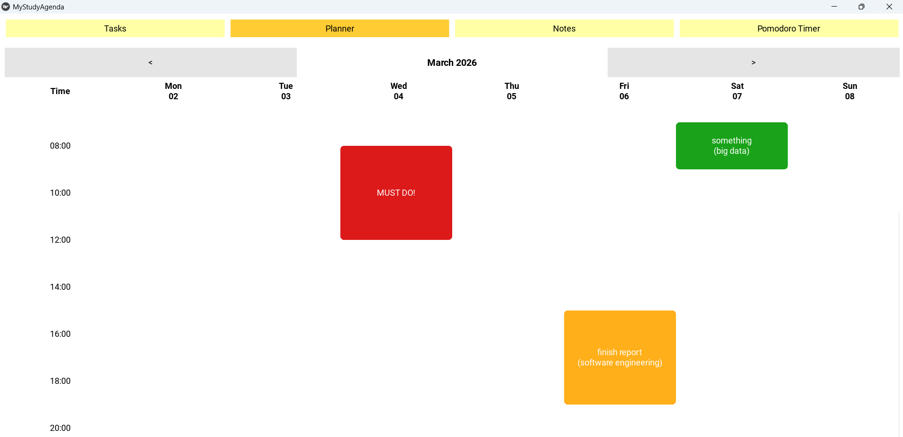
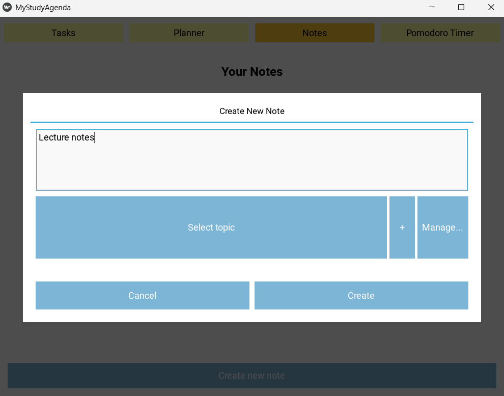
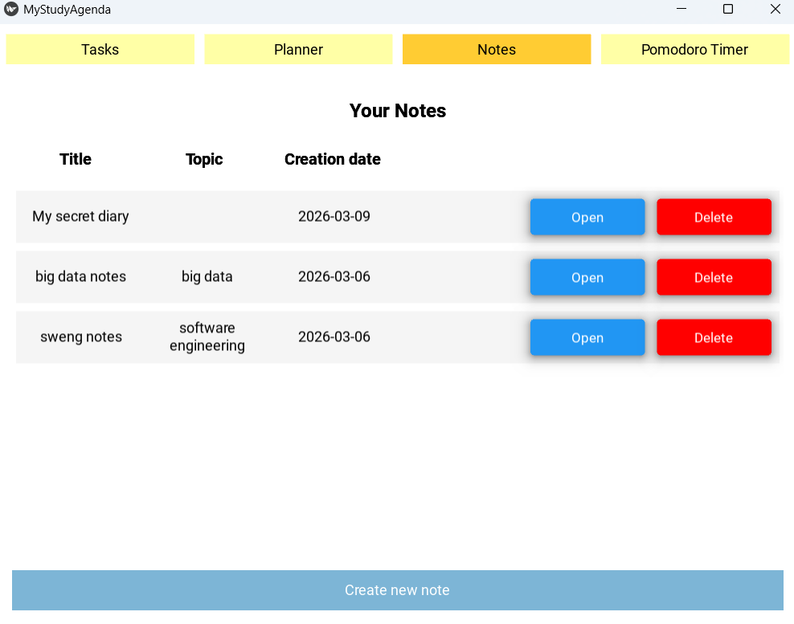
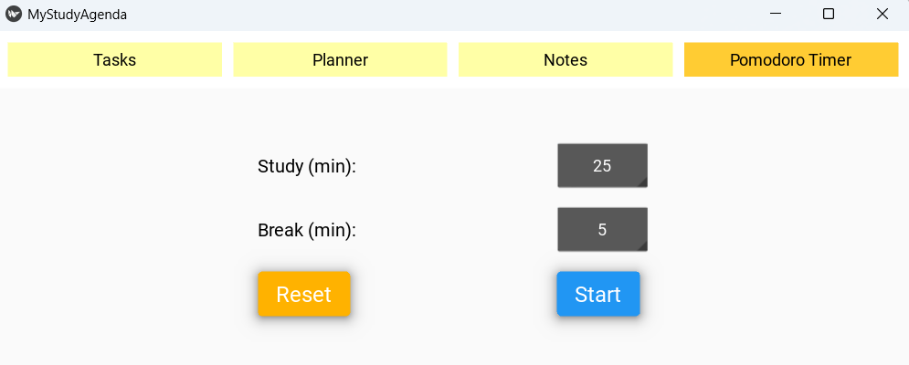
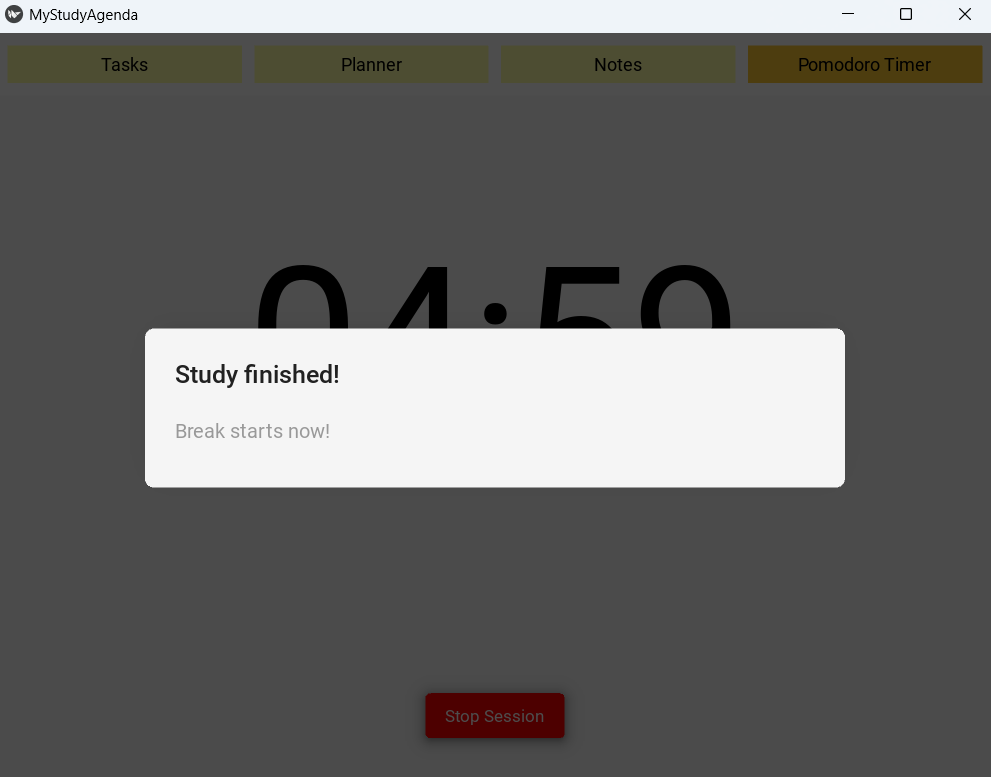

# User Guide

Welcome to your new study (but not only) planner!
Here, you can put your life together by writing down your tasks, assigning them a priority, and scheduling them in your preferred day and time-slot.

Moreover, if you're a fanat of productivity maximization, you can also set up a customized Pomodoro timer, with your preferred duration of work time and break time.

## How To Use
### Task Screen
This is the first screen you will land on as soon as you start the software. Here you can create new tasks by pressing the button at the bottom of the page and compiling a few fields in a form.
> Form to create new task

This form forces you to not leave a blank ask description, and to select a priority level for this task, in order to better visualize your commitments.

I you want, you can also associate the task to a specific topic (for instance, a university course subject) and/or schedule the task at your preferred day and time-slot.

Once you have created a task, it will appear on the Task Screen. You will see that you have the possibility to later set up or change the scheduling data for each task, to delete each task, or even to simply tick it as completed but still keep it in the list.

> Tasks list in task screen

### Planner Screen
This screen is ideal for proper time management and visualization,as it is structured like a weekly planner. Once you have written down all your tasks and commitment, you can also schedule them in your preferred day and time-slot via the Task Screen. Therefore, in the Planner Screen you can visualize them as colored rectangles taking a space in your day.

> Planner view

The different colors of the rectangles represent the different levels of priority:
- Green = low priority
- Yellow = medium priority
- Red = high priority

Each task is represented not only by its description, but also by the name of the topic associated to it (if any), so that it's easier for you to remember what you were referring to when you created and scheduled it.

### Notes Screen
Since this software is thought for improving the quality of studying, it is also very useful to have a section where users can write down their personal notes.
Be it lecture notes or journaling, the notes section is very easy and intuitive to use.

You can create new notes by pressing the button at the bottom of the page and compiling a few fields in a form. Here, you will simply be asked to choose a title for your notebook and, if you'd like, also a topic associated to it.

> Form to create a new note

Once you click on the "Cerate" button, you will be immediately directed inside the notebook and can start taking notes right away. Press the "Save" button on the bottom-left of the screen if you'd like to save your changes. Press the "Back" button if you would like to go back to the notes screen. If you press "Back" without having saved your changes, they will be lost.

After you have created a new note, it will appear on the Notes Screen. Here, you can open pre-existing notes to edit them or even just visualize their content, or you can delete them.

> Notes screen

### Pomodoro Timer Screen
The Pomodoro timer screen is ideal for all those users that like to have fixedtime intervals for their working and break times.

The traditional [Pomodoro technique](https://en.wikipedia.org/wiki/Pomodoro_Technique) sees 25 minutes for deep concentration working time, and 5-minute breaks. Therefore, as soon as you land on this screen, you wil find study time and break time set, respectively, to these values.

However, it is possible to customize both of these values by clicking on the numbers and then selecting the preferred duration from the spinner. In particular, for the study time it is possible to choose any value that is a multiple of 5, up to a maximum of 120 minutes, while for the break time the maximum is 60 minutes.

> Pomodoro screen

Once you have selected your preferred values, you can start the timer with the "Start" button.

By pressing the "Reset" button, the study and break time will be resetted to the default Pomodoro technique values (25 and 5 respectively).

Once the timer is started, a "Stop Session" button allows to interrupt it and go back to the Pomodoro timer screen.

When the study timer finishes, it automatically switches to the break timer (and viceversa) and the user is alerted via a screen message like the one showed below.

Both timers continue in loop until the user stops the session or closes the software. While the timer is on, the user is free to navigate the other software screens.

> Timer finished alert

